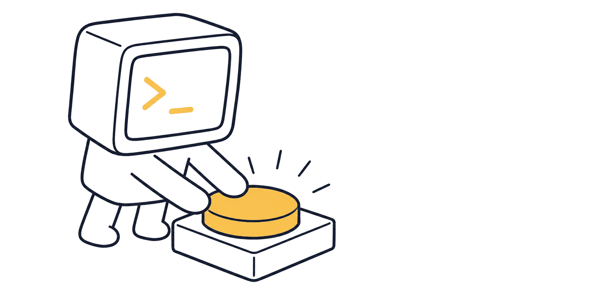

<div align="center">
  
  <h1>keep5</h1>
  <p><b>Reclaim the time you waste waiting.</b></p>
  <a href="https://github.com/imkmao/keep5/stargazers"></a>
  <a href="LICENSE"></a>
  
  
  <a href="https://keep5.pages.dev"></a>
</div>

Keep your Claude Code and Codex subscription windows starting **as early as possible**, so you waste less time waiting.

It does **not** give you more quota. It optimizes **time, not usage** — the hours you were away become time already served on your next lockout.

## The problem

Claude Code and Codex subscriptions use 5-hour usage windows. The catch is the same:

> **After a window's reset time passes, the next window does not start on its own.** It starts only when you send your next request.

So if your window resets at 13:00 but you don't come back until 16:00, your new 5-hour window starts at 16:00 — three hours thrown away, and it compounds across the week.

## What it does

A tiny one-shot script, run every few minutes by a background scheduler (launchd on macOS, a systemd `--user` timer on Linux). Each run:

- Each enrolled runtime has its own reset clock. Before it is due, that runtime is silent.
- Claude Code sends the existing minimal OAuth request and reads the 5-hour/weekly reset headers.
- Codex uses the official `codex app-server`, waits for a completed minimal inference, and saves a reset only after two observations agree. A moving `now+5h` idle projection is rejected.
- If a weekly limit is the wall, keep5 saves that reset and waits instead of retrying every few minutes.
- One runtime failing is logged without stopping the other.

That single request both *starts* the next window and *reports* when it ends. As long as the job runs, your window is always kept "alive" the moment it's eligible.

Zero Python dependencies (stdlib only). macOS or Linux. One Claude Code account and one Codex account, with deliberately separate hardcoded paths and no provider framework. If either platform changes how windows work, that path breaks, and that's fine.

## Install

Two layers: **get it onto your machine** (git's job), then **start using it** (`keep5`'s job). Same on macOS and Linux — `keep5 enable` picks the right scheduler for you.

```sh
# 1. get it — nothing of ours is "installed" here; git just clones the source
git clone https://github.com/imkmao/keep5.git
cd keep5
chmod +x keep5.py
ln -sf "$PWD/keep5.py" /usr/local/bin/keep5   # puts `keep5` on your PATH (sudo if needed)

# 2. optional: sign Codex in with your ChatGPT subscription
codex login      # on a headless box: codex login --device-auth

# 3. start using it
keep5 setup      # set up Claude and/or enroll the current Codex ChatGPT login
keep5 enable     # install + start the background job
```

That's it. **After the one-time install above, first run is just `keep5 setup` → `keep5 enable`.** You may skip Claude at the token prompt; Codex is enrolled only by this explicit setup run, never merely because a login appears later.

### Upgrading from 1.0.0

The launchd label changed in 1.1.0 (`com.imsodasu.keep5` → `com.imkmao.keep5`, following a
GitHub rename). If you installed 1.0.0 on macOS, clear the old job once, or you'll end up
running two:

```sh
launchctl unload ~/Library/LaunchAgents/com.imsodasu.keep5.plist
rm ~/Library/LaunchAgents/com.imsodasu.keep5.plist
keep5 enable
```

Linux is unaffected — the systemd units were never named after the account.

## Keep it running

A background listener is inherently at odds with a machine that goes to sleep: a window boundary that falls while the scheduler isn't ticking is missed until it wakes. This is by design, not a bug keep5 tries to fix — so give it a machine that stays up.

- **macOS** — launchd doesn't tick while asleep. Set the Mac never to sleep (on power), as you would for any always-on tool.
- **Linux** — needs **systemd** (the default on Ubuntu, Debian, Fedora, Arch, and most desktop/server distros). A `--user` service stops when you log out unless *lingering* is on. `keep5 enable` turns it on when it can; if it can't (it usually needs root), it tells you to run `sudo loginctl enable-linger $USER`. And, as on macOS, don't let the box suspend.

`keep5 status` shows the linger state on Linux, so you can see at a glance whether it survives logout.

## Commands

`keep5` is a single script. With **no argument** it's the tick the scheduler calls; **with an argument** it's the management CLI.

| Command | What it does |
|---|---|
| `keep5 setup` | Set up either or both runtimes. Paste or skip the Claude OAuth token; if `codex` is present, enroll its existing **ChatGPT** login. API-key login is rejected because it uses separate API billing. |
| `keep5 enable` | Install the background job (a launchd plist on macOS, a systemd `--user` service + timer on Linux) and start it. Tells you to run `keep5 setup` first if you haven't. |
| `keep5 disable` | Stop and remove the background job — no more ticks. |
| `keep5 status` | Setup and next reset for Claude Code and Codex, plus scheduler/interval and Linux linger state. One screen; fire history lives in the log. |
| `keep5 version` | Print the version (`keep5 <x.y.z>`) and exit. |
| `keep5` | One tick — what the scheduler runs every few minutes. Silent unless it's time to fire. |

```console
$ keep5 status
claude setup: yes
codex setup:  yes
enabled:      yes  (tick every 5m)
claude reset: in 2h13m  (08-26 18:00 PDT)
codex reset:  in 3h54m  (08-26 19:41 PDT)
```

The relative wait comes first. The timestamp is the host machine's local time,
with its time-zone abbreviation shown explicitly; there is no keep5 time-zone
setting.

## Config

Exactly two knobs:

- **Trigger interval** — where it lives depends on the OS:
  - macOS: `StartInterval` (seconds) in `~/Library/LaunchAgents/com.imkmao.keep5.plist`.
  - Linux: `OnUnitActiveSec` in `~/.config/systemd/user/keep5.timer`.

  Default `300` (5 min). To change it: edit that value, then `keep5 disable && keep5 enable` to reload (enable won't overwrite an existing unit, so your edit sticks). Worst case you lose one interval per window — 5 min ≈ 1.7% of a 5-hour window.
- **Enable / disable** — `keep5 enable` / `keep5 disable`.

No config file.

## State & logs

Everything lives under `~/.keep5/`:

- `oat` — your token (`chmod 600`).
- `next_reset` — Claude Code's current reset time (Unix seconds).
- `codex_next_reset` — Codex enrollment plus reset state. Successful setup writes `0`, so the next tick establishes the first real reset.
- `log` — one line per fire, prefixed `claude` or `codex`: `ok: next reset <iso>`, `weekly-limited: waiting for weekly reset <iso>`, `codex pending: waiting to confirm reset; state unchanged`, or `failed: <error>`. Silent ticks write nothing. Unexpected crashes go to `/tmp/keep5.err`.

`keep5 status` reads these for you; the log is there when you want the full fire history.

## Build your own

There's no magic here — one stdlib Python file, and a coding agent could write you your own in an afternoon. If you'd rather do that, [**BUILD-YOUR-OWN.md**](BUILD-YOUR-OWN.md) is the map: Claude's headers, Codex App Server's completion/reset handshake, weekly fallback, and scheduler wiring.

Or just use this one — same result, nothing to build, nothing to maintain.

## Disclaimer

This tool interacts with the service through **automated requests**. Doing so may touch the provider's Terms of Service. You use it **at your own risk**, including any risk to your account. It is provided free, as-is, with no warranty. If the provider ever changes windows to reset automatically, the problem disappears and this tool is no longer needed — that's its ideal death.

Free, forever. No Pro version, no SaaS.

## License

[MIT](LICENSE) © 2026 imkmao.
